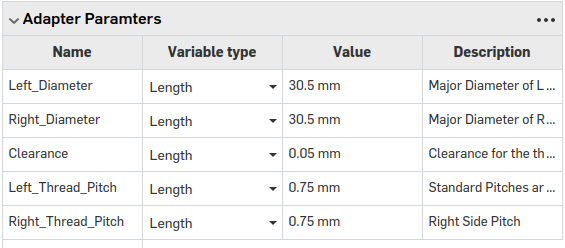

# TM-Lab-Mesoscope-Resources

## Lens Adapters

All the lens adapters are parametrically created using this onshape file:

https://cad.onshape.com/documents/2f0def30531779d17ee9e510/w/bf5702dd5ef345ce03ccb7df/e/dbd37cfbbbade1fbfb717a2f?renderMode=0&uiState=656536ea70c36e66cdf41a41



Adjust these parameters to change the adapters parameters, the diameter is the inner diameter of the lens, pitch is usually 0.5 or 0.75

## Strobing Trigger

### Circuit Diagrams


### Triggering Unit 


### Routing 


### I/O


For the Master Clock in / power in pin out from left to right is 
- master clock
- ground
- power (5v)

for Timing signal the pinout is
- Brain timing control
- Behavior timing control
- Strobing timing control

with the switches controlling in the same order.

In order to control the width of the timing signal supply a pwm signal to each of the width control signals, with the width corresponding to change in signal. The supplied signal should be greater than 1khz and ideally as high frequency as possible to reduce artifacts

the timing and output pots allow for manual control of timing and output voltage, although each of them can cause errors if pushed to their limits due to variation in their ranges from manufacturing. Never turn the timing pots all the way to the right as that might cause a short

### Using

To use supply a 50hz PWM signal to the master clock with as wide a PWM as possible, the width of the signal corresponding to the maximum possible exposure time.

Supply a 5khz PWM signal for each width control pin in to control the exposure for brain and the behaviour cameras independently. Make sure the switch is switched to ON for the control pin being used. The Width of the PWM signal corresponds with the timing, with the widest signal being the longest exposure time.

Simulation of the circuit can be found at: https://tinyurl.com/ykhpxhtl

### Control Example Code
```import RPi.GPIO as GPIO
import time

# Set GPIO mode and warning
GPIO.setmode(GPIO.BCM)
GPIO.setwarnings(False)

# Define the pin numbers
master_clock_pin = 17
width_control_pin = 18

# Set the frequency for the master clock (50Hz)
master_clock_frequency = 50

# Set the duty cycle for the master clock (99% width)
master_clock_duty_cycle = 99

# Set the frequency for the width control (5kHz)
width_control_frequency = 5000

# Initialize the GPIO pins
GPIO.setup(master_clock_pin, GPIO.OUT)
GPIO.setup(width_control_pin, GPIO.OUT)

# Initialize PWM for master clock
master_clock_pwm = GPIO.PWM(master_clock_pin, master_clock_frequency)
master_clock_pwm.start(master_clock_duty_cycle)

# Function to control the width of the second PWM
def set_width(shutter_speed):
    width_percentage = shutter_speed * 100
    width_control_pwm.ChangeDutyCycle(width_percentage)

# Initialize PWM for width control
width_control_pwm = GPIO.PWM(width_control_pin, width_control_frequency)
width_control_pwm.start(0)  # Start with 0% duty cycle

try:
    # Example: Set shutter speed to 0.5 (50% duty cycle)
    shutter_speed = 0.5
    set_width(shutter_speed)

    # Keep the program running
    while True:
        time.sleep(1)

except KeyboardInterrupt:
    # Clean up on program exit
    master_clock_pwm.stop()
    width_control_pwm.stop()
    GPIO.cleanup()
```


# Throughole Based Triggering System
For making the throughhole 555 trigger there is a .xlsx file with the digikey order needed to create one system. The list can also be found at this link: https://www.digikey.ca/en/mylists/list/3F61W3LRA3. Then the components can be placed on the board based on the silkscreen.


## Circuit Drawing


# Solenoid Driver

The Driver is based on using M7 Mosfet drivers, which max out at ~300 mA of current draw at 12V, anything higher will damage and burn out the driver over time. Not suitable for high power solenoids.

## Circuit Drawing


# Glass Slide Cutting Jigs
https://cad.onshape.com/documents/586ecae177d828403c2f23cb/w/295fcf84d2d2bd0672364755/e/c55ac1745cc839e1a44f1998?renderMode=0&uiState=657b82dfe9d1321263616ee4

the Glass Slide Cutting Jig is parameterized by a variable table which determines the depth of the first and second cuts, made to cut 8mm diameter glass slides, should be 3d printed on fine print settings.

# Columbia Mouse Cup Clear Sides Model
https://cad.onshape.com/documents/b81ce74945475cb4a4585191/w/58aa1f17095117351b4c242d/e/5ae7ff2c3d7fb6816ba1f3a7?renderMode=0&uiState=657b8323ea32e231b383538c

Clear Sided mouse cup for water reaching task. The sides should be laser cut out of 3mm acrylic, the main cup 3d printed.

# Headfix Mount
https://cad.onshape.com/documents/1d2096fc56ebea0ce0825b22/w/af5d367c825ef3549394acac/e/f6e60455f61b46eaad854045?renderMode=0&uiState=657b836199fdb972703cfb45

Model and Drawing for headfix mount, should be tapped and machined. Used JLCPCB to order the Machined versions.

